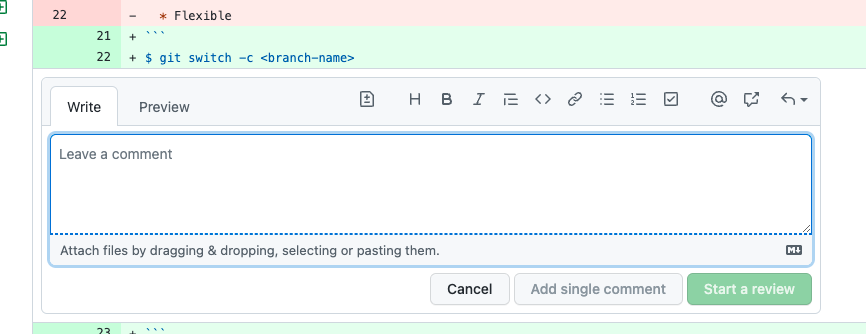

# Code Reviews

## Overview

This repository is designed to teach students the code review process using [Github pull requests](https://docs.github.com/en/pull-requests/collaborating-with-pull-requests/proposing-changes-to-your-work-with-pull-requests/about-pull-requests).  

Students will each create a separate pull request from one of three functions and accompanying tests listed in [functions.md](./functions.md).

## Instructions

In teams of 2-3:

1. Select one student who will fork and add teammates as collaborators.
1. Clone the repository and each student selects **one** (1) function from the [list of functions](./functions.md) to add.
1. Each student individually creates a branch, writes their function, commits their changes and pushes the branch up to the remote repository.
    - For example:  If **Jaeda** is working on the [`merge_sorted_lists`](./functions.md) function
        1. They could create a branch named `jaeda/merge_sorted_lists`
        1. Then write their code, and tests
        1. Verify the code works by creating a virtual environment, installing the dependencies, and running the tests with `pytest`
        1. Then use `git add` and `git commit` to commit their changes
        1. Then use `git push origin jaeda/merge_sorted_lists` to push the branch up to github
1. Open a pull request and add their teammates as reviewers.
1. As a team review each pull request using Github, writing comments and suggestions.

## Reviewing the Pull Requests

Then, as a team, students will review each pull request making comments and suggestions.  Discuss the code and talk about things you observe.

Specifically look for:

1.  Style and readability issues
1.  Efficiency issues
1.  Testing Issues

Make suggestions for improvement using Github's PR review interface.  In most code reviews you may also look for items to praise and learn from.

### To Review a Pull Request

In the Github repository click on **Pull requests** and click on the pull request you want to review.  Then select  **Files changed**.

Then we can click on the **+** sign to add comments to lines of code.

